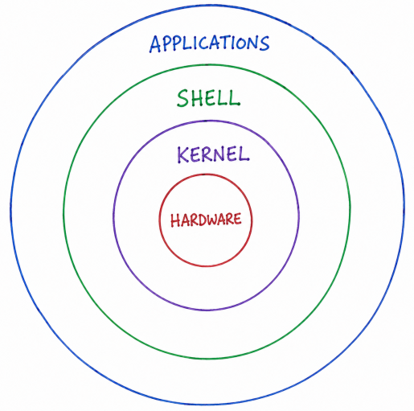

# 🚀 Day 02 – Linux Architecture, Processes, and systemd


# Linux Architecture




# 🧩 Core Components of Linux

| Component | Description |
|-----------|-------------|
| 🖥️ Hardware | CPU, RAM, Disk, Network devices |
| ⚙️ Kernel | Manages hardware, memory, processes and system resources |
| 💻 Shell | Command-line interface between user and kernel |
| 📦 Applications | Programs that run in user space |
| 🔧 systemd | First process (PID 1), manages services and boot |
| 👤 User Space | Area where users and applications execute |

---

# ⚡ Process in Linux

A **process** is a running instance of a program.

### Examples

- nginx
- sshd
- docker
- python

Every process has a unique **PID (Process ID).**

### Common Commands

```bash
ps -ef
top
```


# 🔄 Process States

```text
New
 │
 ▼
Ready
 │
 ▼
Running
 │
 ├────────► Waiting
 │              │
 │              ▼
 └────────── Ready

Running
   │
   ▼
Terminated
```

| State | Meaning |
|---------|---------------------------|
| 🆕 New | Process is created |
| 🟢 Ready | Waiting for CPU |
| ▶️ Running | Executing on CPU |
| ⏳ Waiting | Waiting for resource/event |
| ❌ Terminated | Process execution completed |

---

# 🔧 Understanding systemd

**systemd** is the first process started by the Linux kernel (**PID 1**).

### Responsibilities

- ✅ Starts services during boot
- ✅ Manages system services
- ✅ Controls startup sequence
- ✅ Restarts failed services

### Example

```bash
systemctl status sshd
```

---

# 🛠️ 5 Commonly Used Linux Commands

| Command | Purpose |
|----------|-----------------------------|
| `ps` | View running processes |
| `top` | Monitor system resources |
| `systemctl` | Manage services |
| `df -h` | Check disk usage |
| `free -h` | Check memory usage |

