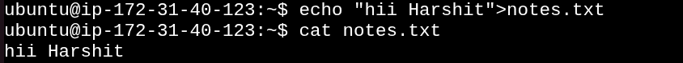
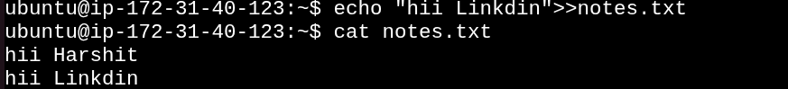
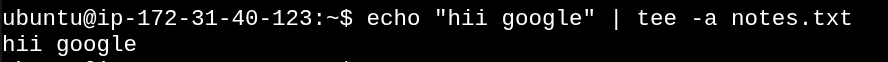
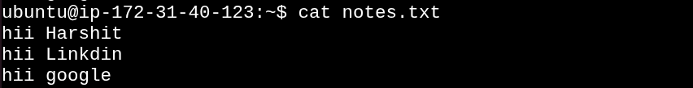
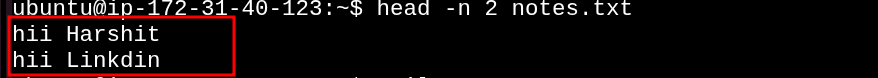
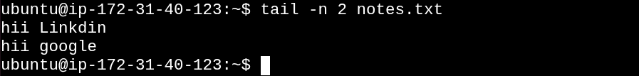

# DAY 06 Read and Write Text Files in Linux

This document demonstrates basic Linux file handling operations including file creation, writing, appending, and reading file contents.

## Command 1: Create a Text File

```bash
touch notes.txt
```


### Observation

* Successfully created an empty file named `notes.txt`.

---

## Command 2: Write First Line to File

```bash
echo "hii Harshit" > notes.txt
```



### Observation

* Added the first line to the file.
* The `>` operator overwrites existing content.

---

## Command 3: Append Second Line

```bash
echo "hii Linkdin" >> notes.txt
```



### Observation

* Added a new line to the existing file.
* The `>>` operator appends data without removing previous content.

---

## Command 4: Append Third Line Using tee

```bash
echo "hii google" | tee -a notes.txt
```



### Observation

* Displayed output on the terminal.
* Simultaneously appended output to the file.

---

## Command 5: Display Entire File

```bash
cat notes.txt
```



### Observation

* Displayed all file contents stored in `notes.txt`.

---

## Command 6: Display First Two Lines

```bash
head -n 2 notes.txt
```



### Observation

* Displayed the first two lines of the file.

---

## Command 7: Display Last Two Lines

```bash
tail -n 2 notes.txt
```



### Observation

* Displayed the last two lines of the file. 

---

# What I Learned

* Created files using `touch`.
* Wrote text into files using `echo`.
* Understood the difference between `>` (overwrite) and `>>` (append).
* Used `tee -a` to write and display output simultaneously.
* Read complete file contents using `cat`.
* Viewed specific sections of a file using `head` and `tail`.

# Conclusion

Day 06 focused on fundamental Linux file handling operations. These commands are commonly used for managing configuration files, logs, scripts, and documentation in Linux and DevOps environments.
