# Day 07 - Linux File System Hierarchy & Scenario-Based Practice


# Part 1: Linux File System Hierarchy

## 1. / (Root Directory)

### Purpose

The root directory is the top-level directory in Linux. Every file and directory starts from here.

### Command

```bash
ls -l /
```

### Output

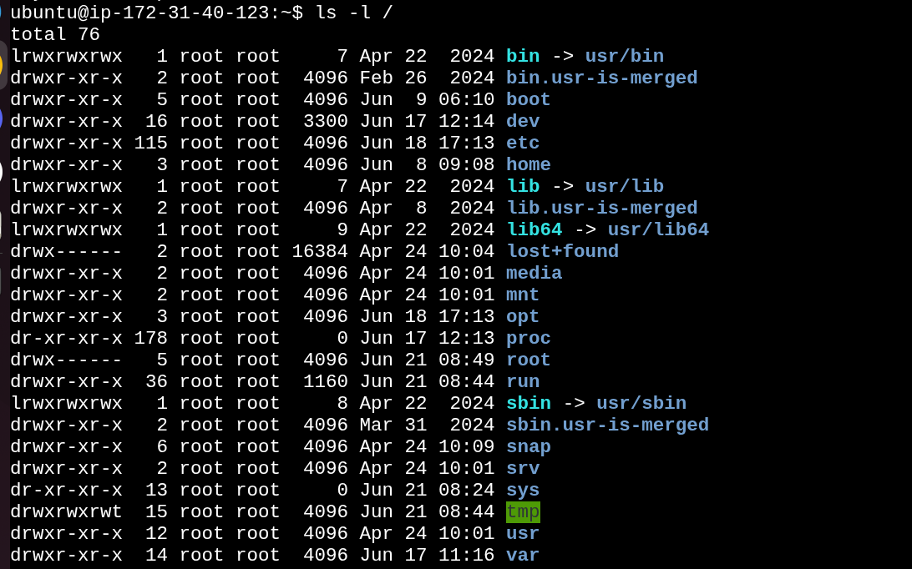

### I would use this when...

I need to navigate the Linux file system from the starting point.

---

## 2. /home

### Command

```bash
ls -l /home
```

### Output

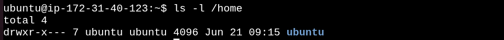

### I would use this when...

I need to access user files and personal data.

---

## 3. /root

### Command

```bash
ls -l /root
```

### Output

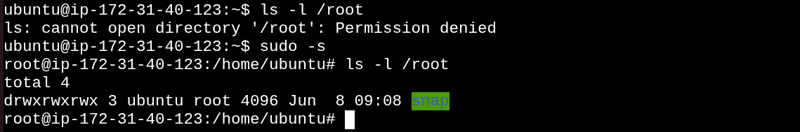

### I would use this when...

I am working as the root user.

---

## 4. /etc

### Command

```bash
ls -l /etc
```

### Output

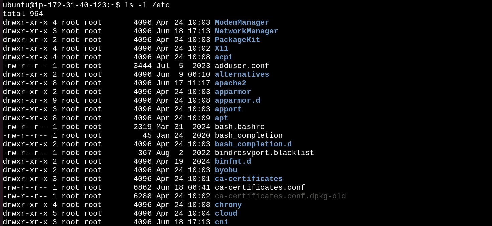

### I would use this when...

I need to check or edit configuration files.

---

## 5. /var/log

### Command

```bash
ls -l /var/log
```

### Output

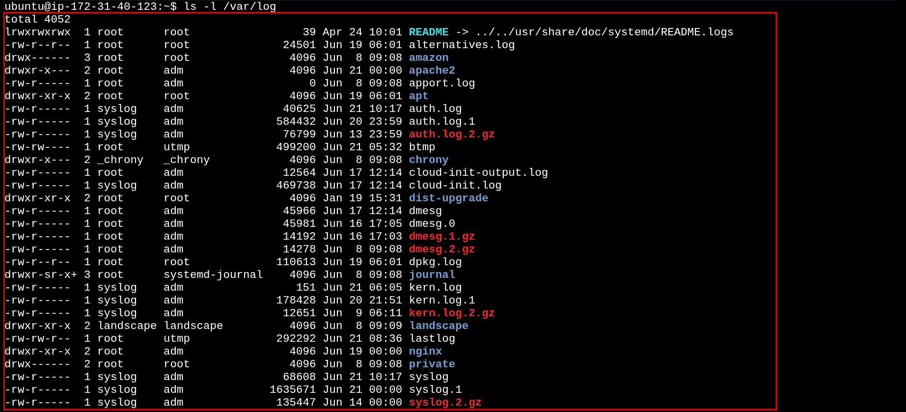

### I would use this when...

I am troubleshooting system or application issues.

---

## 6. /tmp

### Command

```bash
ls -l /tmp
```

### Output

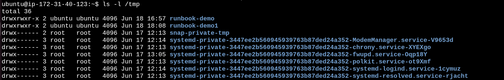

### I would use this when...

I need temporary storage during testing.

---

## 7. /bin

### Command

```bash
ls -l /bin
```

### Output

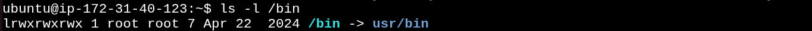

---

## 8. /usr/bin

### Command

```bash
ls -l /usr/bin
```

### Output

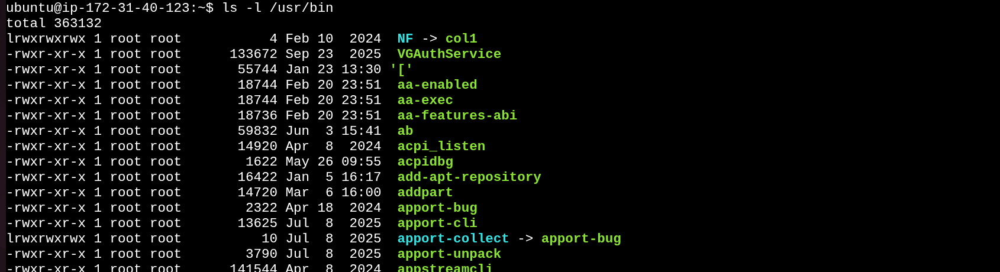

---


# Hands-On Commands

## Find Largest Log Files

```bash
du -sh /var/log/* 2>/dev/null | sort -h | tail -5
```

### Output

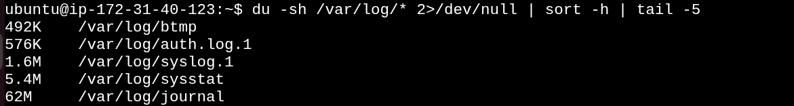

---

## Check Hostname

```bash
cat /etc/hostname
```

### Output

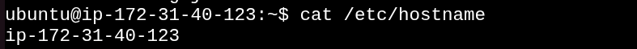

---

## Check Home Directory

```bash
ls -la ~
```

### Output

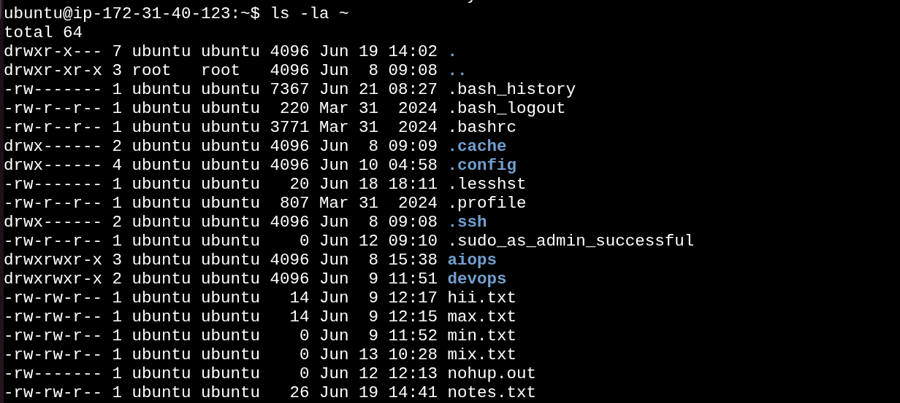

---


# Scenario 1 - Service Not Starting


### Step 1

```bash
systemctl status apache2
```

### Output
 
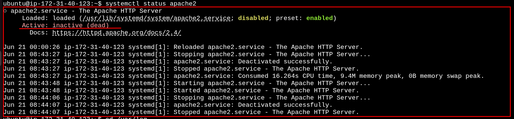

### Step 2

```bash
journalctl -u apache2 -n 5
```

### Output

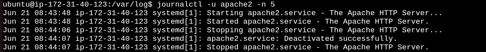

### Step 3

```bash
systemctl is-enabled apache2
```

### Output

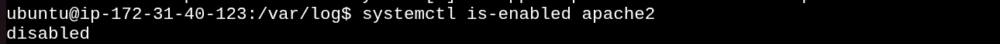

### Step 4

```bash
systemctl list-units --type=service
```

### Output

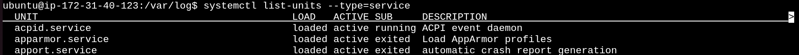

---


# Scenario 2 - High CPU Usage

### Step 1

```bash
top
```

### Output

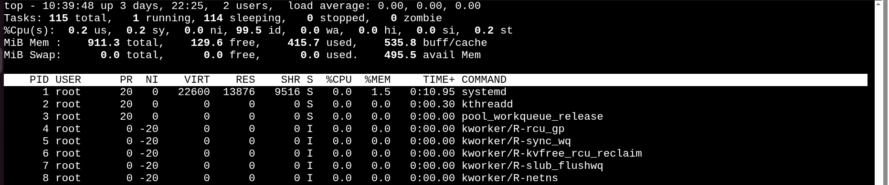

### Step 2

```bash
ps aux --sort=-%cpu | head -10
```

### Output

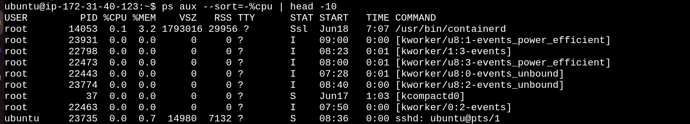

### Step 3

```bash 
ps -p <PID> -f
```

### Output

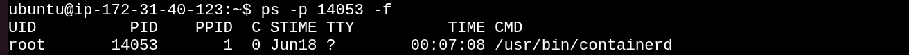)


---


# Scenario 3 - Finding Service Logs

### Step 1

```bash
systemctl status nginx
```

### Output

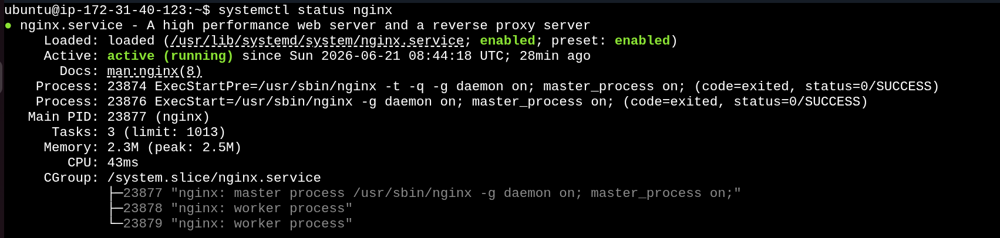

### Step 2

```bash
journalctl -u nginx -n 5
```

### Output

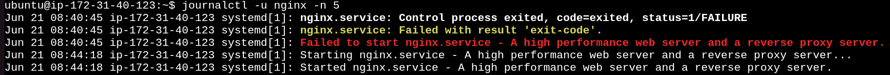

### Step 3

```bash
journalctl -u nginx -f
```

### Output

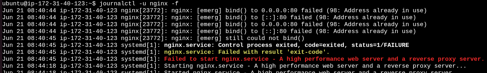

---


# Scenario 4 - File Permission Issue

### Step 1

```bash
ls -l /home/user/backup.sh
```

### Output

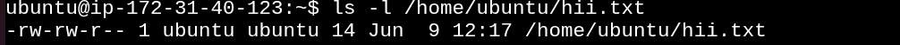

### Step 2

```bash
chmod +x /home/user/backup.sh
```

### Output


### Step 3

```bash
ls -l /home/user/backup.sh 
```
### Output

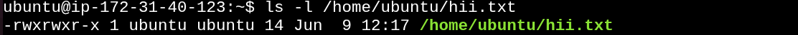

---

### Key Takeaway

Understanding Linux directories, logs, services, and permissions is essential for troubleshooting like a DevOps Engineer.
