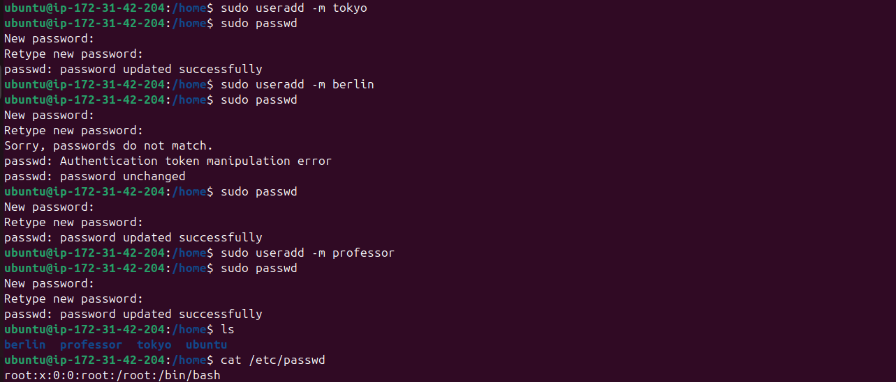

# Day 09 - Linux User & Group Management Challenge

## Tasks

Today I practiced Linux user and group management by performing hands-on tasks including:

* Creating users and setting passwords
* Creating groups and assigning users
* Configuring shared directories
* Managing file permissions
* Configuring team workspaces

---

# Task 1: Create Users

## Users Created

* tokyo
* berlin
* professor

## Commands Used

```bash
sudo useradd -m tokyo
sudo passwd tokyo

sudo useradd -m berlin
sudo passwd berlin

sudo useradd -m professor
sudo passwd professor
```

## Verification

```bash
cat /etc/passwd | grep -E "tokyo|berlin|professor"
```

## Output



---

# Task 2: Create Groups

## Groups Created

* developers
* admins

## Commands Used

```bash
sudo groupadd developers
sudo groupadd admins
```

## Verification

```bash
cat /etc/group | grep -E "developers|admins"
```

## Output


---

# Task 3: Assign Users to Groups

## Group Memberships

| Group        | Members           |
| ------------ | ----------------- |
| developers   | tokyo, berlin     |
| admins       | berlin, professor |
| project-team | nairobi, tokyo    |

## Commands Used

```bash
sudo usermod -aG developers tokyo
sudo usermod -aG developers berlin

sudo usermod -aG admins berlin
sudo usermod -aG admins professor
```

## Verification

```bash
cat /etc/group | tail
```

## Output


---

# Task 4: Create Shared Directory

Created a shared directory for the developers group.

## Directory

```text
/opt/dev-project
```

## Commands Used

```bash
sudo mkdir -p /opt/dev-project
sudo chgrp developers /opt/dev-project
sudo chmod 775 /opt/dev-project
```

## Verification

```bash
ls -ld /opt/dev-project
```

## Output


---

# Task 5: Verify Home Directories

Verified that home directories were created successfully.

## Command

```bash
ls /home
```

## Output


---

# Task 6: Test Shared Directory Access

Verified that both users could create files inside the shared directory.

## Commands Used

```bash
sudo -u tokyo touch /opt/dev-project/file1.txt

sudo -u berlin touch /opt/dev-project/file2.txt

ls -l /opt/dev-project
```

## Output


---

# Task 7: Create Team Workspace

Created a new team workspace for the **project-team** group.

## User Created

* nairobi

## Group Created

* project-team

## Workspace

```text
/opt/team-workspace
```

## Commands Used

```bash
sudo useradd -m nairobi
sudo passwd nairobi

sudo groupadd project-team

sudo gpasswd -a nairobi project-team
sudo gpasswd -a tokyo project-team

sudo mkdir -p /opt/team-workspace
sudo chgrp project-team /opt/team-workspace
sudo chmod 775 /opt/team-workspace
```

## Verification

```bash
groups nairobi
ls -ld /opt/team-workspace
```

## Output


---

# What I Learned

* Learned how to create Linux users and groups.
* Understood how to assign users to multiple groups.
* Learned to manage file and directory permissions using `chmod` and `chgrp`.
* Practiced creating shared directories for team collaboration.
* Understood how Linux group permissions help multiple users work securely on shared projects.

---

# Commands Used

* `useradd`
* `passwd`
* `groupadd`
* `usermod`
* `gpasswd`
* `mkdir`
* `chgrp`
* `chmod`
* `groups`
* `cat`
* `ls`
* `touch`
* `sudo`
