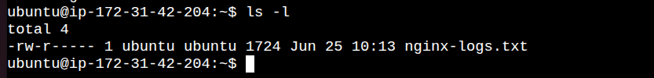
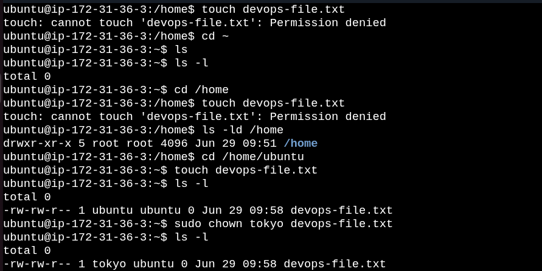
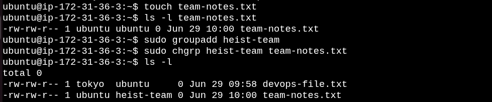
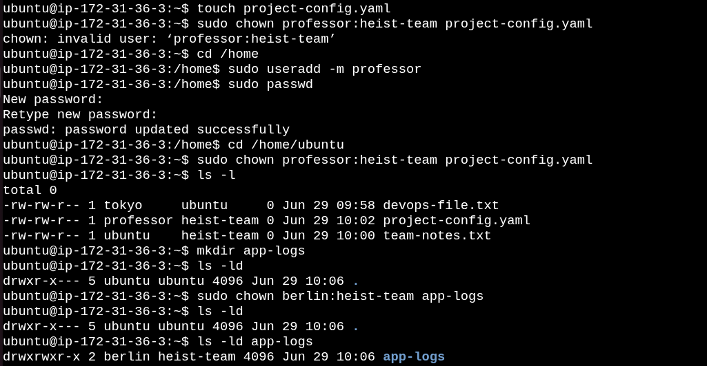
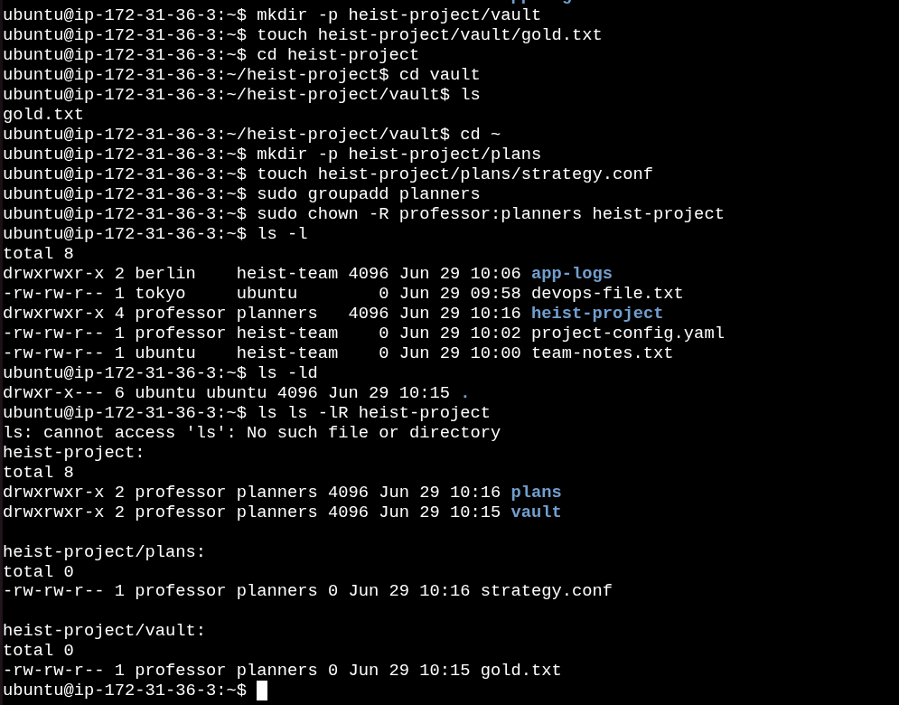
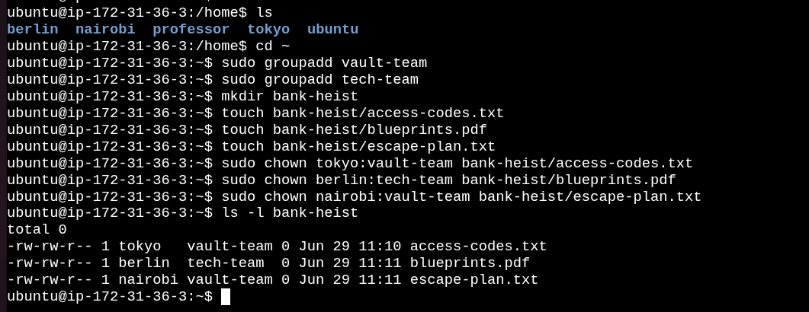

# Day 11 – Linux File Ownership (chown & chgrp)


Today's i learned how Linux file ownership works and practiced changing file owners and groups using `chown` and `chgrp`.


# Task 1: Understanding File Ownership

## Commands

```bash
ls -l
```

## Output

 

### What I Learned

* Every file has an **Owner** and a **Group**.
* Ownership determines who can access or modify a file.

---

# Task 2: Changing File Owner

## Commands

```bash
touch devops-file.txt

ls -l devops-file.txt

sudo chown tokyo devops-file.txt

sudo chown berlin devops-file.txt

ls -l devops-file.txt
```

## Output

 


---

# Task 3: Changing File Group

## Commands

```bash
touch team-notes.txt

sudo groupadd heist-team

sudo chgrp heist-team team-notes.txt

ls -l team-notes.txt
```

## Output

 

---

# Task 4: Change Owner and Group Together

## Commands

```bash
touch project-config.yaml

sudo chown professor:heist-team project-config.yaml

mkdir app-logs

sudo chown berlin:heist-team app-logs

ls -l
```

## Output

 


---

# Task 5: Recursive Ownership

## Commands

```bash
mkdir -p heist-project/vault
mkdir -p heist-project/plans

touch heist-project/vault/gold.txt
touch heist-project/plans/strategy.conf

sudo groupadd planners

sudo chown -R professor:planners heist-project

ls -lR heist-project
```

## Output

 

---

# Task 6: Practice Challenge

## Commands

```bash
Create users: tokyo, berlin, nairobi (if not already created)
sudo groupadd vault-team
sudo groupadd tech-team

mkdir bank-heist

touch bank-heist/access-codes.txt
touch bank-heist/blueprints.pdf
touch bank-heist/escape-plan.txt

sudo chown tokyo:vault-team bank-heist/access-codes.txt

sudo chown berlin:tech-team bank-heist/blueprints.pdf

sudo chown nairobi:vault-team bank-heist/escape-plan.txt

ls -l bank-heist
```

## Output

 

---

# Commands I Used

```bash
ls -l
# Displays detailed file information including permissions, owner, and group

touch filename
# Creates a new empty file

mkdir directory_name
# Creates a new directory

mkdir -p path
# Creates nested directories if they do not exist

sudo groupadd groupname
# Creates a new group

sudo chown username filename
# Changes the owner of a file

sudo chgrp groupname filename
# Changes the group of a file

sudo chown username:groupname filename
# Changes both owner and group of a file

sudo chown -R username:groupname directory
# Recursively changes owner and group for a directory and its contents

ls -lR directory
# Displays detailed information of all files and subdirectories recursively
```

---

# What I Learned

* Every file in Linux has an owner and a group.
* `chown` changes the file owner.
* `chgrp` changes the file group.
* `chown owner:group` changes both owner and group together.
* `-R` applies ownership changes recursively.
