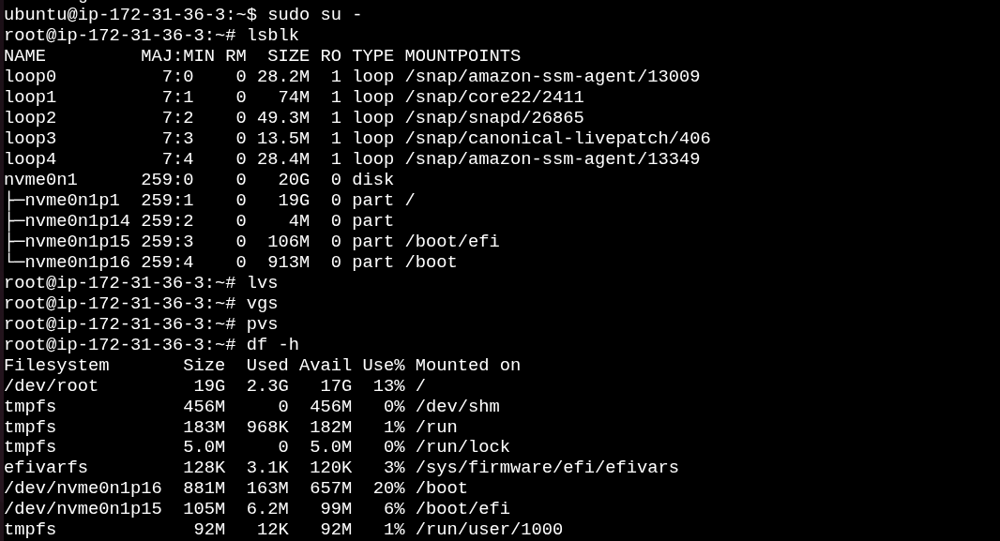
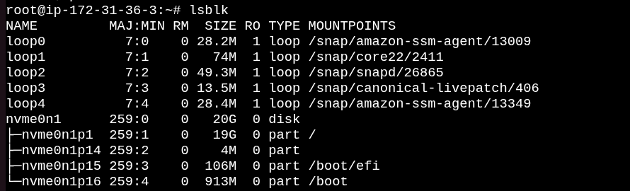
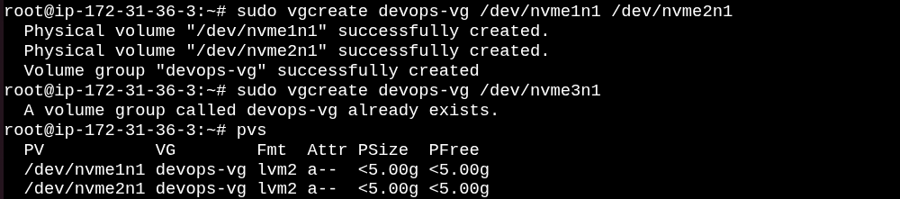
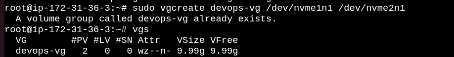
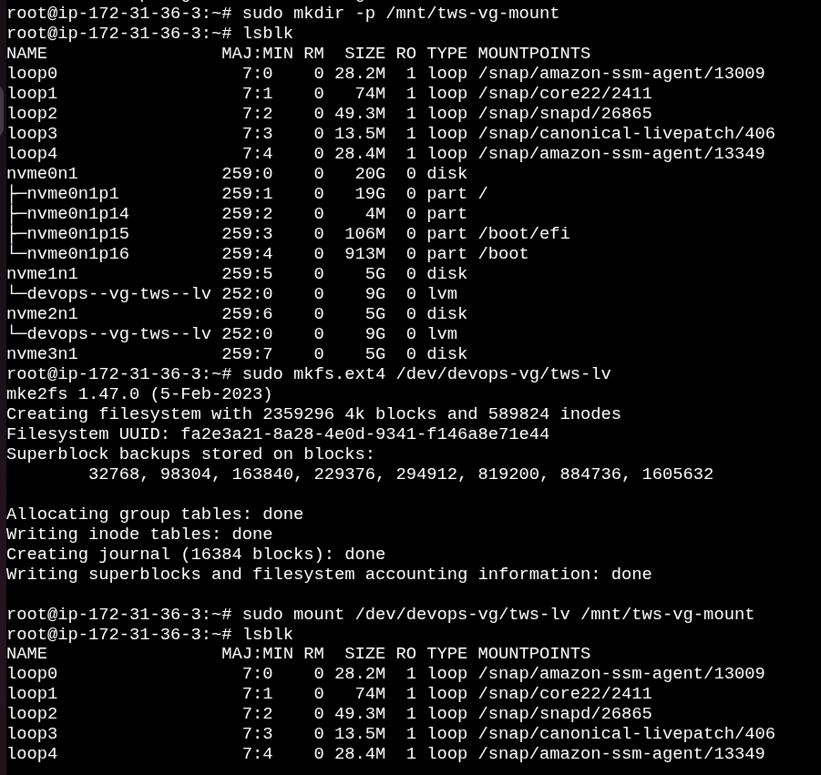
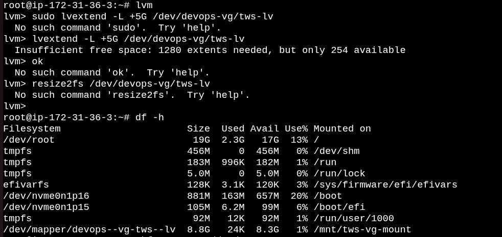
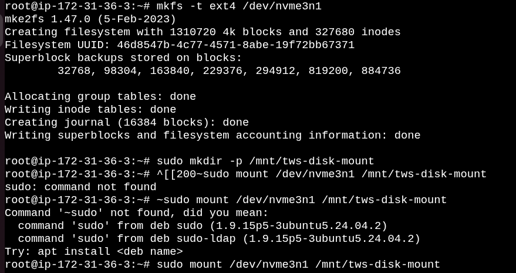

# 🚀 Day 13 - Linux Logical Volume Manager (LVM)


Today's I Learn how Linux Logical Volume Manager (LVM) provides flexible storage management by creating, mounting, and extending Logical Volumes without repartitioning disks.


# Task 1 - Check Current Storage

Before creating an LVM setup, inspect the current storage devices, mounted filesystems, and existing LVM configuration.

### Commands

```bash
lsblk
df -h
pvs
vgs
lvs
```

### What Each Command Does

- **lsblk** – Lists all block devices and partitions.
- **df -h** – Displays mounted filesystems and available disk space.
- **pvs** – Shows all Physical Volumes.
- **vgs** – Displays all Volume Groups.
- **lvs** – Lists all Logical Volumes.

### 📷 Output

 

---

# Task 2 - Verify Newly Attached EBS Volumes


Verify that the newly attached storage devices are visible to Linux.

### Commands

```bash
lsblk
```

### What Each Command Does

- **lsblk** – Displays newly attached disks such as `/dev/nvme1n1`, `/dev/nvme2n1`, etc.

### 📷 Output

 

---

# Task 3 - Create Physical Volumes (PV)


Initialize raw disks so they can be managed by LVM.

### Commands

```bash
sudo pvcreate /dev/nvme1n1 /dev/nvme2n1 /dev/nvme3n1

sudo pvs

sudo pvdisplay
```

### What Each Command Does

- **pvcreate** – Converts disks into Physical Volumes.
- **pvs** – Verifies all Physical Volumes.
- **pvdisplay** – Shows detailed PV information.

### 📷 Output

 

---

# Task 4 - Create Volume Group (VG)


Combine multiple Physical Volumes into one storage pool.

### Commands

```bash
sudo vgcreate devops-vg /dev/nvme1n1 /dev/nvme2n1

sudo vgs

sudo vgdisplay
```

### What Each Command Does

- **vgcreate** – Creates a Volume Group.
- **vgs** – Lists available Volume Groups.
- **vgdisplay** – Shows detailed VG information.

### 📷  Output

 

---

# Task 5 - Create Logical Volume (LV)


Create a Logical Volume from the available storage in the Volume Group.

### Commands

```bash
sudo lvcreate -L 9G -n tws-lv devops-vg

sudo lvs

sudo lvdisplay
```

> **Note:** If `10G` shows **insufficient free space**, create a `9G` Logical Volume or use:

```bash
sudo lvcreate -l 100%FREE -n tws-lv devops-vg
```

### What Each Command Does

- **lvcreate** – Creates a Logical Volume.
- **lvs** – Lists all Logical Volumes.
- **lvdisplay** – Displays detailed Logical Volume information.

### 📷 OutPut
 
 

---

# Task 6 - Format and Mount the Logical Volume


Create a filesystem and mount the Logical Volume.

### Commands

```bash
sudo mkfs.ext4 /dev/devops-vg/tws-lv

sudo mkdir -p /mnt/tws-vg-mount

sudo mount /dev/devops-vg/tws-lv /mnt/tws-vg-mount

df -h
```

### What Each Command Does

- **mkfs.ext4** – Creates an ext4 filesystem.
- **mkdir** – Creates the mount point.
- **mount** – Mounts the Logical Volume.
- **df -h** – Verifies the mounted filesystem.

### 📷 Output

 


---


# Task 7 - Extend the Logical Volume


Increase the storage capacity of the Logical Volume.

### Commands

```bash
sudo lvextend -L +5G /dev/devops-vg/tws-lv

sudo resize2fs /dev/devops-vg/tws-lv

df -h
```

### What Each Command Does

- **lvextend** – Extends the Logical Volume.
- **resize2fs** – Expands the ext4 filesystem.
- **df -h** – Verifies the new size.

### 📷 Output

 


---

# Task 8 - Mount a Disk Without LVM


Understand the difference between mounting a raw disk and using LVM.

### Commands

```bash
sudo mkfs.ext4 /dev/nvme3n1

sudo mkdir -p /mnt/tws-disk-mount

sudo mount /dev/nvme3n1 /mnt/tws-disk-mount
```

### What Each Command Does

- **mkfs.ext4** – Formats the disk.
- **mkdir** – Creates a mount point.
- **mount** – Mounts the disk directly.

### 📷 Output

 


---

# 📚 Commands Used

| Command | Meaning |
|---------|---------|
| lsblk | Lists block devices |
| df -h | Displays disk usage |
| pvcreate | Creates Physical Volumes |
| pvs | Lists Physical Volumes |
| pvdisplay | Shows detailed Physical Volume information |
| vgcreate | Creates a Volume Group |
| vgs | Lists Volume Groups |
| vgdisplay | Shows detailed Volume Group information |
| lvcreate | Creates a Logical Volume |
| lvs | Lists Logical Volumes |
| lvdisplay | Shows detailed Logical Volume information |
| mkfs.ext4 | Creates an ext4 filesystem |
| mkdir | Creates a mount point |
| mount | Mounts a filesystem |
| umount | Unmounts a filesystem |
| lvextend | Extends a Logical Volume |
| resize2fs | Resizes the ext4 filesystem |

---

# 🎓 What I Learned

- Learned the LVM architecture (PV → VG → LV).
- Learned how to initialize disks as Physical Volumes.
- Learned how to combine multiple disks into a Volume Group.
- Learned how to create and manage Logical Volumes.
- Learned how to format and mount Logical Volumes.
- Learned how to verify LVM configuration using `pvs`, `vgs`, and `lvs`.
- Learned how to inspect LVM using `pvdisplay`, `vgdisplay`, and `lvdisplay`.
- Learned how to extend a Logical Volume without repartitioning disks.
- Learned how to resize an ext4 filesystem using `resize2fs`.
- Learned the difference between mounting a raw disk and using LVM.

---

# ✅ Outcome

Successfully configured Linux Logical Volume Manager (LVM), created and managed Logical Volumes, mounted storage, verified persistence, and dynamically extended storage without repartitioning the disks.
