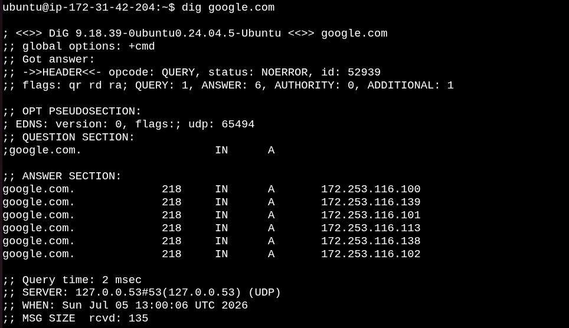

# Networking Concepts: DNS, IP, Subnets & Ports

## Task

Today's I Learn the networking fundamentals every DevOps Engineer should understand, including DNS, IP Addressing, CIDR, Subnetting, and Network Ports.

---

## Task 1: DNS – How Names Become IPs

### 1. What happens when you type `facebook.com` in a browser?

**Answer**

```text
1. The browser first checks its local cache for the IP address.
2. If not found, it sends a DNS request to a DNS server.
3. The DNS server returns the IP address of google.com.
4. The browser connects to that IP address and downloads the webpage.
```

### 2. DNS Record Types

- **A** – Maps a domain name to an IPv4 address.
- **AAAA** – Maps a domain name to an IPv6 address.
- **CNAME** – Creates an alias for another domain.
- **MX** – Specifies the mail server for a domain.
- **NS** – Specifies the authoritative DNS servers.

### 3. Run: `dig google.com`

**Command**

```bash
dig google.com
```


**Purpose**

Retrieve DNS information and verify domain resolution.

**Why We Use It**

Useful for troubleshooting DNS issues and verifying DNS records.

**Output**



**Observation**

- A Record: `142.250.189.142`
- TTL: `268 seconds`


---

## Task 2: IP Addressing

### 1. What is an IPv4 address?

An IPv4 address uniquely identifies a device on a network.

Example:

`192.168.1.10`

- Network Portion: `192.168.1`
- Host Portion: `10`

### 2. Public vs Private IP

| Public IP | Private IP |
|-----------|------------|
| Accessible over the Internet | Used inside local networks |
| Assigned by ISP | Assigned by router/admin |
| Example: `18.224.212.253` | Example: `172.31.41.95` |

### 3. Private IP Ranges

- `10.0.0.0 – 10.255.255.255`
- `172.16.0.0 – 172.31.255.255`
- `192.168.0.0 – 192.168.255.255`

### 4. Run: `ip addr show`

**Command**

```bash
ip addr show
```

**Sample Output**

```text
inet 172.31.41.95/20
inet 127.0.0.1/8
```

**Observation**

- `172.31.41.95` → Private IP
- `127.0.0.1` → Loopback
- `172.31.47.255` → Broadcast

**Purpose**

Display network interfaces and IP addresses.

**Why We Use It**

Used to verify network configuration and troubleshoot connectivity.

**Screenshot**

> Add Screenshot Here

---

## Task 3: CIDR & Subnetting

### What does `/24` mean?

`/24` means the first 24 bits represent the network, leaving 8 bits for host addresses.

| CIDR | Subnet Mask | Total IPs | Usable Hosts |
|------|-------------|-----------|--------------|
| /24 | 255.255.255.0 | 256 | 254 |
| /16 | 255.255.0.0 | 65,536 | 65,534 |
| /28 | 255.255.255.240 | 16 | 14 |

**Why do we subnet?**

- Reduce broadcast traffic
- Improve security
- Better network management

---

## Task 4: Ports – The Doors to Services

### Common Ports

| Port | Service |
|------|---------|
|22|SSH|
|53|DNS|
|80|HTTP|
|443|HTTPS|
|3306|MySQL|
|6379|Redis|
|27017|MongoDB|

### Check SSH Listening Port

**Command**

```bash
sudo ss -tulpn | grep 22
```

**Output**

```text
tcp LISTEN 0 4096 0.0.0.0:22
tcp LISTEN 0 4096 [::]:22
```

**Observation**

- SSH is listening on IPv4 and IPv6.
- Port 22 is open.

**Purpose**

Verify the SSH service is listening.

**Why We Use It**

Ensures remote SSH connections are available.

---

### Test SSH Port

**Command**

```bash
nc -zv localhost 22
```

**Output**

```text
Connection to localhost (127.0.0.1) 22 port [tcp/ssh] succeeded!
```

**Purpose**

Test whether port 22 is reachable.

**Why We Use It**

Quickly verify network connectivity to SSH.

---

## Task 5: Putting It Together

### `curl http://localhost:80`

- Protocol: HTTP
- Hostname: `localhost`
- IP Address: `127.0.0.1`
- Port: `80`
- Service: Apache/Nginx

### Database Connectivity Checks

```bash
ss -tulpn | grep 3306
systemctl status mysql
nc -zv 10.0.1.50 3306
journalctl -u mysql
```

These commands verify:
- MySQL is listening.
- MySQL service is running.
- Database port is reachable.
- Logs contain no errors.

---

## What I Learned

- DNS converts domain names into IP addresses.
- Private and Public IPs serve different purposes.
- CIDR and subnetting improve network efficiency.
- Ports allow multiple services to run on one server.
- Linux networking commands are essential for DevOps troubleshooting.
