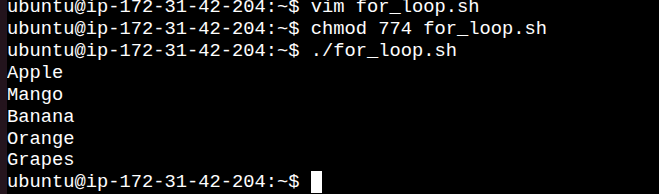

# Day 17 - Bash Scripting: Loops, Arguments & Error Handling

Today I practiced writing more practical Bash scripts by using loops, passing command-line arguments, checking package status, and handling script errors. These concepts are commonly used in Linux administration and DevOps automation.

---

# Task 1: Working with For Loop

### Script: `for_loop.sh`

**Purpose**
- Store a list of fruits.
- Display each fruit one by one using a `for` loop.

[Here is the script for_loop.sh](scripts/for_loop.sh)

### Output



---

### Script: `count.sh`

**Purpose**
- Print numbers from 1 to 10 using a `for` loop.

[Here is the script count.sh](scripts/count.sh)

### Output


---

# Task 2: Using While Loop

### Script: `countdown.sh`

**Purpose**
- Read a number from the user.
- Continue decreasing the value until it reaches zero.
- Display a completion message.

[Here is the script countdown.sh](scripts/countdown.sh)

### Output


---

# Task 3: Command-Line Arguments

### Script: `greet.sh`

**Purpose**
- Receive a username as input.
- Display a greeting message.
- Show a usage message if no argument is supplied.

[Here is the script greet.sh](scripts/greet.sh)

### Output


---

### Script: `args_demo.sh`

**Purpose**
- Display the script filename.
- Show the total number of arguments.
- Print every argument passed to the script.

[Here is the script args_demo.sh](scripts/args_demo.sh)

### Output


---

# Task 4: Package Installation Script

### Script: `install_packages.sh`

**Purpose**
- Verify whether `nginx`, `curl`, and `wget` are installed.
- Install only the missing packages.
- Display the installation status.
- Ensure the script runs only with root privileges.


[Here is the script install_packages.sh](scripts/install_packages.sh)

### Output (Installation)


---

# Task 5: Error Handling

### Script: `safe_script.sh`

**Purpose**
- Create a working directory.
- Move into the directory.
- Create a sample file.
- Stop execution if a critical error occurs.

### Example Output
```
Directory created successfully.
demo.txt created.
Script completed successfully.
```

---

# Key Takeaways

- Learned to automate repetitive tasks with **for** and **while** loops.
- Understood how Bash arguments (`$0`, `$1`, `$#`, `$@`) work.
- Practiced checking software installation status before installing packages.
- Used `set -e` and `||` for basic error handling.
- Improved Bash scripting skills for DevOps automation.

