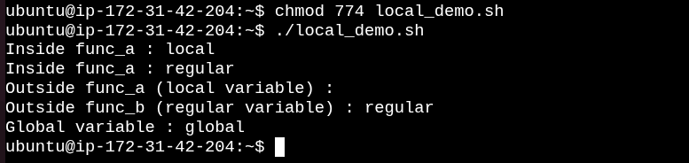
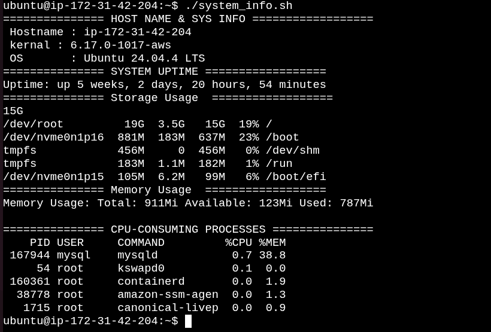

# Day 18 – Shell Scripting: Functions & Intermediate Concepts


Today I learned how to write cleaner and reusable shell scripts using **functions**, **local variables**, and **strict mode (`set -euo pipefail`)**.

---
 
# Task 1 – Basic Functions

- `greet()` accepts one argument and prints a greeting.
- `add()` accepts two numbers and prints their sum.
- `$1` and `$2` represent the first and second arguments passed to the function.

[Here is the script functions.sh](scripts/functions.sh)


---

# Task 2 – Functions with System Information

- `check_disk()` displays root partition usage.
- `check_memory()` displays RAM and swap usage.
- Functions make scripts modular and reusable.

[Here is the script disk_check.sh](scripts/disk_check.sh)


---

# Task 3 – Strict Mode (`set -euo pipefail`)

- `set -e` → Exit immediately if a command fails.
- `set -u` → Exit if an undefined variable is used.
- `set -o pipefail` → Makes a pipeline fail if any command in the pipeline fails.

[Here is the script strict_demo.sh](scripts/strict_demo.sh)


---

# Task 4 – Local Variables

- `local` variables exist only inside the function.
- Normal variables remain available after the function finishes

[Here is the script local_demo.sh](scripts/local_demo.sh)




---

# Task 5 – System Information Reporter

Create `system_info.sh` that uses functions for everything:

1. A function to print hostname and OS information

2. A function to print system uptime

3. A function to print disk usage

4. A function to print memory usage

5. A function to print top CPU-consuming processes

6. A main function that calls all the above functions

7. Use `set -euo pipefail` at the top

[Here is the script system_info.sh](scripts/system_info.sh)



# What I Learned

## 1. Functions

Functions help avoid duplicate code and make scripts cleaner.

Example:

```bash
greet() {
    echo "Hello"
}
```

---

## 2. Local Variables

Using `local` prevents variables from affecting other parts of the script.

Example:

```bash
local name="DevOps"
```

---

## 3. Strict Mode

Using

```bash
set -euo pipefail
```

makes shell scripts much safer by:

- stopping on errors
- preventing undefined variables
- detecting failures inside pipelines

---


#90DaysOfDevOps #DevOpsKaJosh #TrainWithShubham #Linux #ShellScripting #DevOps #Automation
