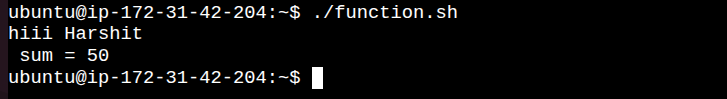
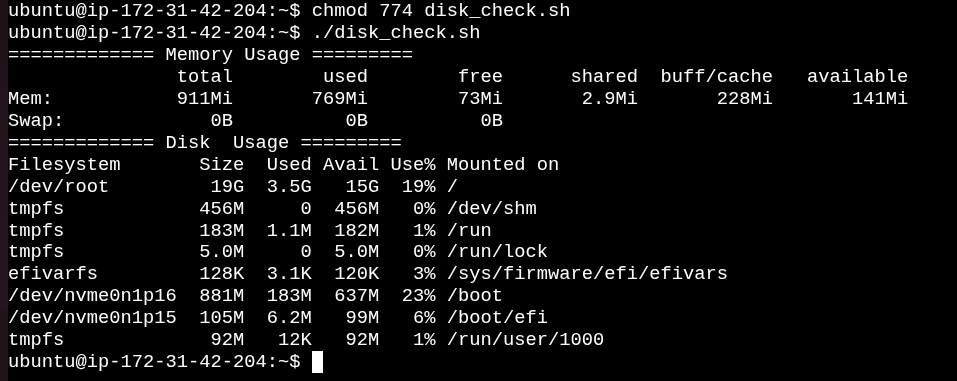
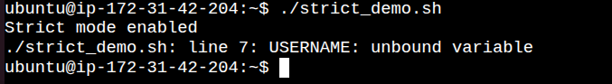

# Day 18 – Shell Scripting: Functions & Intermediate Concepts


Today I learned how to write cleaner and reusable shell scripts using **functions**, **local variables**, and **strict mode (`set -euo pipefail`)**.

---

# Task 1 – Basic Functions

- `greet()` accepts one argument and prints a greeting.
- `add()` accepts two numbers and prints their sum.
- `$1` and `$2` represent the first and second arguments passed to the function.

[Here is the script functions.sh](scripts/functions.sh)



---

# Task 2 – Functions with System Information

- `check_disk()` displays root partition usage.
- `check_memory()` displays RAM and swap usage.
- Functions make scripts modular and reusable.

[Here is the script disk_check.sh](scripts/disk_check.sh)



---

# Task 3 – Strict Mode (`set -euo pipefail`)

- `set -e` → Exit immediately if a command fails.
- `set -u` → Exit if an undefined variable is used.
- `set -o pipefail` → Makes a pipeline fail if any command in the pipeline fails.

[Here is the script strict_demo.sh](scripts/strict_demo.sh)



---

# Task 4 – Local Variables

## File: `local_demo.sh`

```bash
#!/bin/bash

demo_local() {
    local message="I am local"
    echo "Inside function: $message"
}

demo_global() {
    message="I am global"
}

demo_local
echo "Outside function: ${message:-Variable not found}"

demo_global
echo "Outside after global function: $message"
```

### Output

```
Inside function: I am local
Outside function: Variable not found
Outside after global function: I am global
```

### Explanation

- `local` variables exist only inside the function.
- Normal variables remain available after the function finishes.

---

# Task 5 – System Information Reporter

## File: `system_info.sh`

```bash
#!/bin/bash

set -euo pipefail

system_info() {
    echo "========== System Information =========="
    hostname
    cat /etc/os-release | grep PRETTY_NAME
}

uptime_info() {
    echo
    echo "========== Uptime =========="
    uptime
}

disk_usage() {
    echo
    echo "========== Top 5 Largest Directories =========="
    du -sh /* 2>/dev/null | sort -hr | head -5
}

memory_usage() {
    echo
    echo "========== Memory Usage =========="
    free -h
}

cpu_usage() {
    echo
    echo "========== Top 5 CPU Processes =========="
    ps -eo pid,comm,%cpu --sort=-%cpu | head -6
}

main() {
    system_info
    uptime_info
    disk_usage
    memory_usage
    cpu_usage
}

main
```

### Sample Output

```
========== System Information ==========
ip-172-31-0-10
Ubuntu 22.04 LTS

========== Uptime ==========
20:15 up 4 days, 3 users, load average: 0.10, 0.05, 0.03

========== Top 5 Largest Directories ==========
5.1G /var
2.8G /usr
1.3G /home
...

========== Memory Usage ==========
total used free shared buff/cache available

========== Top 5 CPU Processes ==========
PID COMMAND %CPU
1234 java 35.1
789 python 21.3
...
```

---

# What I Learned

## 1. Functions

Functions help avoid duplicate code and make scripts cleaner.

Example:

```bash
greet() {
    echo "Hello"
}
```

---

## 2. Local Variables

Using `local` prevents variables from affecting other parts of the script.

Example:

```bash
local name="DevOps"
```

---

## 3. Strict Mode

Using

```bash
set -euo pipefail
```

makes shell scripts much safer by:

- stopping on errors
- preventing undefined variables
- detecting failures inside pipelines

---

# Repository Structure

```
2026/
└── day-18/
    ├── functions.sh
    ├── disk_check.sh
    ├── strict_demo.sh
    ├── local_demo.sh
    ├── system_info.sh
    └── day-18-scripting.md
```

---

# Git Commands

```bash
git add .

git commit -m "Day 18: Shell Functions, Local Variables and Strict Mode"

git push origin main
```

---

# Key Takeaways

✅ Learned how to create reusable functions

✅ Understood the importance of `local` variables

✅ Learned why every production shell script should use:

```bash
set -euo pipefail
```

to make scripts reliable and easier to debug.

---

# LinkedIn Post

**Day 18 of #90DaysOfDevOps 🚀**

Today I explored intermediate shell scripting concepts.

✔️ Created reusable shell functions

✔️ Learned function arguments and return behavior

✔️ Used local variables to avoid variable leakage

✔️ Understood why `set -euo pipefail` is considered best practice

✔️ Built a modular System Information Reporter using functions

Every day I'm improving my Linux automation skills and moving one step closer to becoming a DevOps Engineer.

#90DaysOfDevOps #DevOpsKaJosh #TrainWithShubham #Linux #ShellScripting #DevOps #Automation
