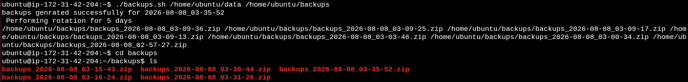
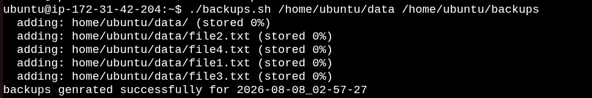

# Day 19 – Shell Scripting Project: Log Rotation, Backup & Crontab


 Today's I applied Shell Scripting concepts from Days 16–18 to create real-world server maintenance automation.

The project contains:

* Log rotation script
* Server backup script
* Crontab scheduling


---

# Task 1 – Log Rotation Script

## File: `log_rotate.sh`

### Purpose

The `log_rotate.sh` script performs log management.

It:

Takes the source directory and backup directory as arguments.
Generates a timestamp using date.
Creates a compressed .zip backup using the zip -r command.
Displays a success message after the backup is generated.

[Here is the script log_rotate.sh](scripts/log_rotate.sh)

 

---

# Task 2 – Server Backup Script

## File: `backups.sh`

### Purpose

The `backups.sh` script creates a compressed server backup.

It:

Finds all existing backup ZIP files.
Uses ls -t to arrange backups from newest to oldest.
Keeps the latest 5 backups.
Stores backups after the latest 5 in the backups_to_remove array.
Deletes the older backups using rm -f.


[Here is the script backup.sh](scripts/backups.sh)



---

# Task 3 – Crontab

## Check Existing Cron Jobs

```bash
crontab -l
```

## Cron Syntax

```text
* * * * * command
│ │ │ │ │
│ │ │ │ └── Day of week (0-7)
│ │ │ └──── Month (1-12)
│ │ └────── Day of month (1-31)
│ └──────── Hour (0-23)
└────────── Minute (0-59)
```

---

## 1. Log Rotation Every Day at 2 AM

```bash
0 2 * * * /home/ubuntu/scripts/log_rotate.sh /var/log/myapp
```

Explanation:

```text
0     = minute
2     = hour
*     = every day
*     = every month
*     = every day of week
```

---

## 2. Backup Every Sunday at 3 AM

```bash
0 3 * * 0 /home/ubuntu/scripts/backup.sh /home/ubuntu/data /home/ubuntu/backups
```

Here:

```text
0 = Sunday
```

---

## 3. Health Check Every 5 Minutes

```bash
*/5 * * * * /home/ubuntu/scripts/health_check.sh
```

The reference asks for these three cron entries as part of Task 3.


---

# What I Learned

1. I learned how to create timestamped backups using Shell Scripting.
2. I learned how to automate log rotation.
3. I learned how to use Crontab to schedule regular server maintenance tasks.

---

# Conclusion

Day 19 helped me apply Shell Scripting concepts to real-world Linux administration.

I created a backup script for automated server backups, a log rotation script for managing old logs that combines both operations.

Finally, I used Crontab to automate these tasks at scheduled times.


