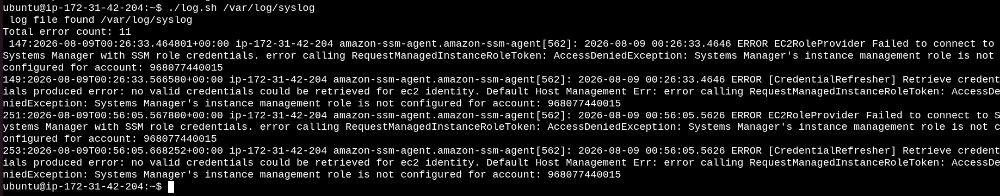
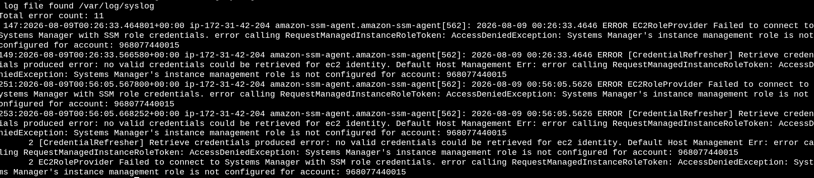
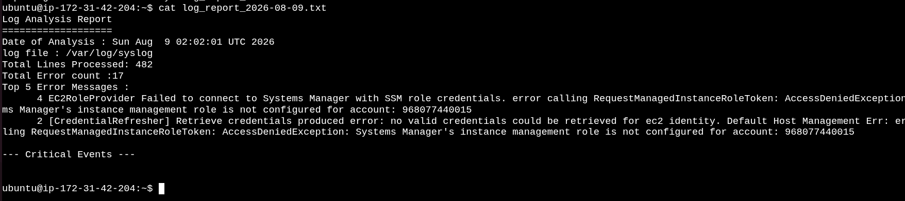

# Day 20 – Bash Scripting Challenge: Log Analyzer and Report Generator


Today's challenge is to analyze a log file using Bash scripting and generate a daily summary report.

The log analyzer performs the following tasks:

1. Input and file validation
2. Error count
3. Critical event detection
4. Top 5 error messages
5. Summary report generation
---

## Step 1: Input and Validation

The first step is to accept the path of a log file as a command-line argument.

The script should validate:

* Whether the user provided a log file path
* Whether the specified log file exists
* Whether an appropriate error message should be displayed when validation fails

[Here is the script input_valid.sh](scripts/input_valid.sh)


---

## Step 2: Error Count

The second step is to analyze the log file and count lines containing the keywords:

* `ERROR`
* `Failed`

The total number of matching lines should be displayed on the console.

[Here is the script error_count.sh](scripts/error_count.sh)


---

## Step 3: ERROR Events

The third step is to search the log file for entries containing the keyword:

```text
ERROR
```

The output should include both:

* The line number
* The complete ERROR event

[Here is the script ERROR.sh](scripts/critical.sh)



---

## Step 4: Top 5 Error Messages

The fourth step is to analyze all log entries containing `ERROR` and identify the **five most common error messages**.

The results should be:

* Counted
* Sorted in descending order
* Limited to the top five messages

[Here is the script top_error.sh](scripts/top_error.sh)



---

## Step 5: Summary Report

The fifth step is to generate a daily summary report.

The report should be saved with the following naming format:


The report should contain:

1. Date of analysis
2. Log file name
3. Total number of lines processed
4. Total error count
5. Top 5 error messages
6. Critical events with line numbers


[Here is the script log_analyzer_report.sh](scripts/log_analyzer_report.sh)





---

## Commands and Tools Used

| Command   | Purpose                         |
| --------- | ------------------------------- |
| `grep`    | Search for specific keywords    |
| `grep -n` | Search and display line numbers |
| `wc -l`   | Count lines                     |
| `awk`     | Process and extract text        |
| `sed`     | Modify and extract text         |
| `sort`    | Sort results                    |
| `uniq -c` | Count duplicate entries         |
| `head`    | Display the top results         |
| `date`    | Generate the report date        |
| `mkdir`   | Create the archive directory    |
| `mv`      | Move processed log files        |


---

## Conclusion

The **Log Analyzer and Report Generator** challenge provided practical experience with Bash scripting and Linux text-processing commands.

Instead of manually checking a large log file, the process can be automated to:

**Read Log → Validate → Count Errors → Find Critical Events → Analyze Top Errors → Generate Report**

This is a useful Bash scripting concept for **Linux administration, DevOps, monitoring, and troubleshooting**.

---

