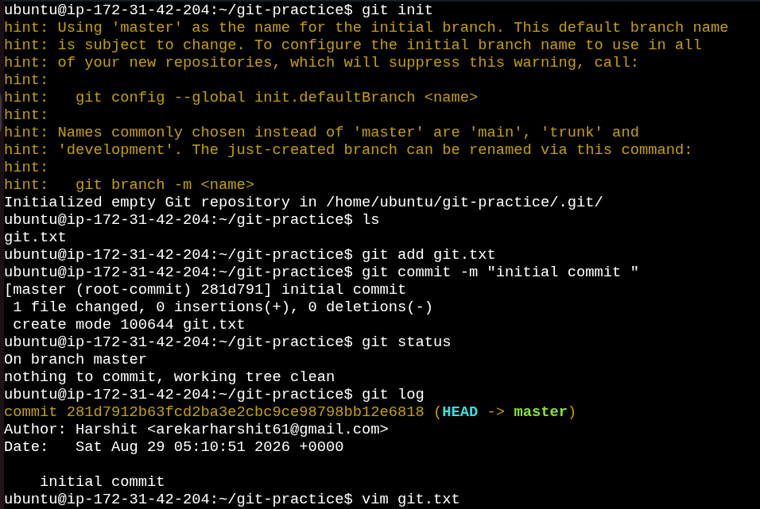
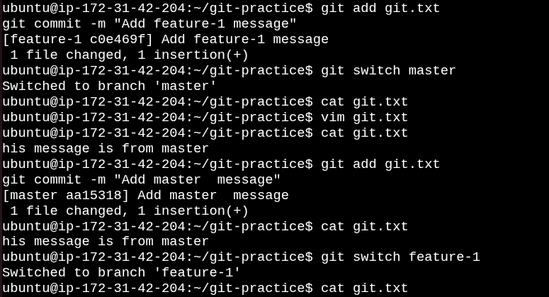
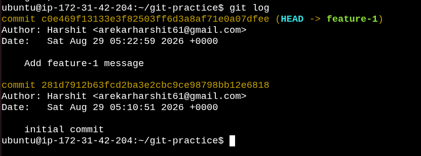

# Day 23 – Git Branching & Working with GitHub

Today I practiced Git branching commands using my devops-git-practice repository.

---

## Task 1: Understanding Branches

### 1. What is a branch in Git?

- A branch is a separate workspace used to make changes without affecting the main project.
- A branch points to a commit in Git history.

### 2. Why do we use branches instead of committing everything to `main`?

- If we commit everything directly to `main`, it may break the project.
- We use branches to test and develop features safely before merging.

### 3. What is `HEAD` in Git?

- `HEAD` points to the latest commit in the current branch.

### 4. What happens to your files when you switch branches?

- Git updates your working directory to match the selected branch.
  - Untracked files remain unchanged.
  - Tracked files change according to the branch.
  - Uncommitted changes may block switching.

---
## Task 2: Branching Commands — Hands-On

1. List all branches in your repo

2. Create a new branch called `feature-1`

3. Switch to `feature-1`

4. Create a new branch and switch to it in a single command — call it `feature-2`

5. Try using `git switch` to move between branches — how is it different from `git checkout`?

6. Make a commit on `feature-1` that does not exist on `main`

7. Switch back to `main` — verify that the commit from `feature-1` is not there

8. Push your branches to GitHub

9. Verify both branches are visible on GitHub

---
